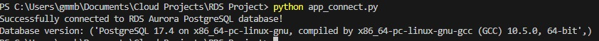

# AWS RDS Aurora PostgreSQL Connection Demo

This project demonstrates how to **create, connect, and interact with an Amazon RDS Aurora PostgreSQL database** directly from **VS Code using Python**.  
It’s part of my cloud learning journey where I explore practical AWS setups from **development → deployment**.

---

## Features
- Create and configure an **Aurora PostgreSQL** database on **Amazon RDS**
- Securely connect to the database from a local development environment (VS Code)
- Execute queries and insert real data using **Python + psycopg2**
- Follow best practices for **security, backups, and scalability**

---

## Tech Stack
- **AWS RDS (Aurora PostgreSQL 17.4)**
- **Python 3.10+**
- **psycopg2**
- **AWS Secrets Manager / Environment Variables**
- **VS Code**

---

## Setup Instructions

### 1 Clone the Repository

```bash
git clone https://github.com/Bel-94/AWS-RDS
cd AWS-RDS
```

### 2 Configure environment variables
- Create **.env** file in the project root and add:

```bash
DB_HOST=your-db-endpoint.amazonaws.com
DB_NAME=practice_db
DB_USER=postgres
DB_PASS=your-password
```

**Important:** Never commit your **.env** file
**Add it to .gitignore for security**

---

#### Example Python Script to Check if your RDS Database is successfully connected

```bash
import psycopg2, os

db_host = os.getenv("DB_HOST")
db_name = os.getenv("DB_NAME")
db_user = os.getenv("DB_USER")
db_pass = os.getenv("DB_PASS")

try:
    connection = psycopg2.connect(
        host=db_host,
        database=db_name,
        user=db_user,
        password=db_pass,
        port=5432
    )
    cursor = connection.cursor()
    print("Successfully connected to RDS Aurora PostgreSQL!")

    cursor.execute("SELECT version();")
    print("Database version:", cursor.fetchone())

finally:
    if connection:
        cursor.close()
        connection.close()
```

#### Example Output
